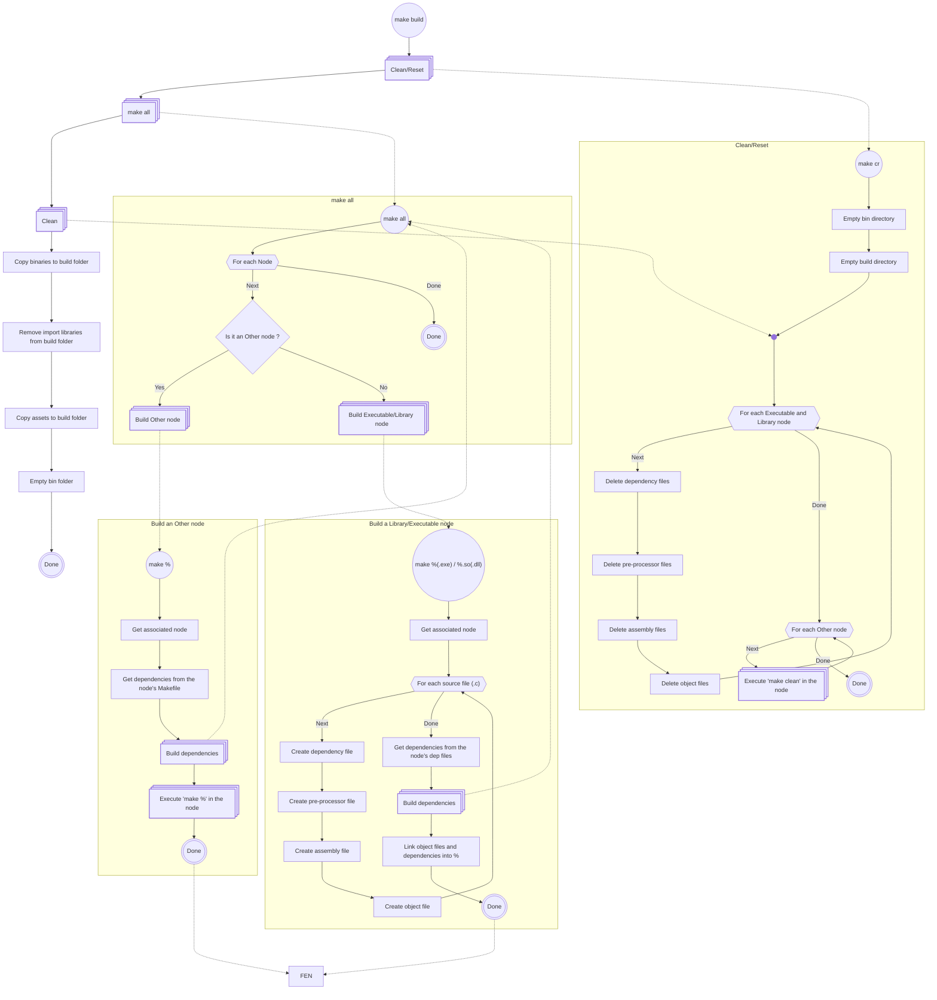

# C-template

This is a template intended for multi-purpose C projects, that can easily be modified for C++.

## Installation

Clone the repo :
```bash
git clone https://github.com/Bitwise-re/c-template.git
``` 
Or using ssh : 
```bash
git clone git@github.com:Bitwise-re/c-template.git
```

Then delete history :
```bash
rm -r .git
git init
```

> [!TIP]
> You can also click on `use this template` on the repo page to create a new repo based on this template.


## Project Structure

```
/
├── .github/
|   └── workflows
|       ├── build.yml
|       ├── deploy.yml
|       └── test.yml
├── bin/
├── build/
|   ├── assets/
|   ├── linux/
|   └── windows/
├── scripts/
|   ├── createnode.sh
|   └── getnodes.sh
├── src/
│   └── app/
|       ├── main.c
|       └── flags.gcc
├── temp/
├── templates/
|   ├── lib.c
|   ├── lib.h
|   ├── main.c
|   └── onode.mk
├── test/
├── LICENSE
├── Makefile
├── README.md
└── vars.mk
```

## Usage

### The Nodes

The source folder is structured by nodes, there are 3 types of node :
- __Other node__ \
Other nodes are custom nodes holding their own Makefile which should include 3 specific variables : \
`__FILES` -> holds the files built by this node.\
`__DEPS` -> holds the files on which depend the files above.\
`__IMPL_LINK` -> How to implement the node's files in the linking step of another file which depend on those files. \
A node containing a Makefile is processed as an *Other node*.

- __Executable node__ \
Executable nodes hold the source code for an executable.
A node containing a main.c file is processed as an *Executable node*.
- __Library node__ \
Library nodes are holding source code for shared libraries (`.dll` on windows and `.so` on linux).
Any node which isn't an *Executable node* nor an *Other node* is processed as a *Library node*. 

### The Makefiles

There are 2 main Makefiles in this template : [./Makefile](https://github.com/Bitwise-re/c-template/blob/main/Makefile) wich holds the recipes and [./vars.mk](https://github.com/Bitwise-re/c-template/blob/main/vars.mk) which holds all structure related variables as well as functions for the recipes.

Project structure, extensions used and flags for each step of the build chain can be found in [./vars.mk](https://github.com/Bitwise-re/c-template/blob/main/vars.mk).

> [!TIP]
> While the flags for each step of the build chain are the same for every node, you can add flags for the linking step by adding them in `{step_id}.flags`, where *step_id* can be found in [./vars.mk](https://github.com/Bitwise-re/c-template/blob/main/vars.mk).. Each flags with the prefix W_ will be used for windows builds and L_ for linux builds.

### Adding files to be built

To add an executable, just create a new subfolder in `./src/`containing a `main.c` file. 
Same for adding a file with custom build process : just create a new subfolder in `./src/` containing a `Makefile`.
To add a library, create a new subfolder in `./src/` with source code in it.
To add ressources/assets to be directly inserted in the final product's root folder, put them in `./build/assets`.

> [!TIP]
> To add new nodes, the main Makefile provides recipes :
> | Node Type | Command |
> | --- | --- |
> | Executable | make \__ne\_{node_name} |
> | Library | make \__nl\_{node_name} |
> | Other | make \__no\_{node_name} |

## The build process



## Included Github Workflows

This templates comes with Github Workflows.
- Test :
  Triggered on PR, used to verify modifications to important branches does not bring bugs.
  Passes the code through a series of tests, including the whole buildling process, in different environnements.
- Build :
  Triggered on demand by other workflows, covers the whole building process for the linux and windows app.
- Deploy :
  Triggered by a push on the main branch, calls the build process and package the output into a release.

## Contributing

Pull requests are welcome. For major changes, please open an issue first
to discuss what you would like to change.

> [!CAUTION]
> Please make sure to update tests as appropriate.

## License

This project is under [GNU 3 License](https://github.com/Bitwise-re/c-template/blob/main/LICENSE)


